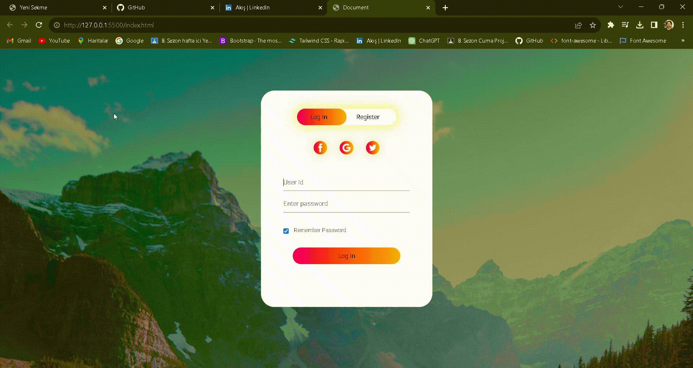

<h2>🚀 Yeni Bir Proje: Özel Tasarım Login Sayfası! 🚀</h2>

Bugün sizlerle HTML, CSS ve JavaScript kullanarak geliştirdiğim özel tasarım bir login sayfasını paylaşmak istiyorum. Bu küçük projede, modern bir görünüm ve kullanıcı dostu bir deneyim sağlamaya odaklandım.

<h2>Kullanılan Teknolojiler</h2>

HTML5: Sayfa yapısını oluşturmak için.
CSS3: Stil ve düzenlemeler için.
JavaScript: İnteraktif özellikler eklemek için.

<h2>Ekran görüntüsü</h2>

